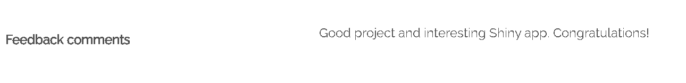

# Enron Email Analysis - R Shiny Project

## Overview
This project focuses on analyzing the Enron email dataset, which contains all email communications between 149 employees from 1999 to 2002. The objective is to transform and analyze the data, extract meaningful insights, and create an **interactive Shiny application** that allows users to explore key patterns and trends.

## Additional Documentation
For detailed project insights, methodology, and findings, refer to:
- **DSTI-Exam.pdf** – Project objectives, requirements, and exam instructions.
- **Enron-Phuc-Nguyen-Rmarkdown.html** – R Markdown report explaining the data processing, analysis, and scientific insights.

## Project Structure
The project consists of two main folders:
1. **Instruction + Raw Data + Data Dictionary** – Contains documentation, raw data files, and the data dictionary.
2. **Solution** – Includes the following files:
   - `Enron-Phuc-Nguyen-Rmarkdown.Rmd` – The R Markdown file containing the analysis and commentary.
   - `Enron-Phuc-Nguyen-Rmarkdown.html` – The compiled HTML report generated from R Markdown.
   - `app.R` – The Shiny application script for interactive data visualization.

## Data Description
The dataset includes:
- **Employee List**: Email addresses and metadata of Enron employees.
- **Messages**: Emails exchanged between employees, including timestamps and content.
- **Recipient Information**: Details of recipients categorized as TO, CC, or BCC.

## Key Analysis & Findings
### 1. Employee Email Activity
- Identified the most active employees in the email database.
- Examined email frequency trends over time.

### 2. Role-based Analysis
- Analyzed communication patterns based on employees' roles within the company.
- Compared managerial-level interactions vs. non-managerial employees.

### 3. Temporal Trends & Public Events
- Studied email activity in correlation with major events related to the **Enron scandal**.
- Observed peaks in communication during critical moments (e.g., SEC investigation, bankruptcy filing).

### 4. Message Content Analysis
- Performed basic sentiment analysis and keyword extraction.
- Identified key topics discussed before and after the scandal broke out.


*Comment from the professor evaluating the project.*

## Shiny Application Features
- **Employee Email Explorer**: Interactive visualization of the most active employees.
- **Role-based Communication Analysis**: Filter and analyze emails based on sender roles.
- **Time Series Analysis**: Visualize email trends over time and correlate with external events.
- **Content Insights**: Extract and display commonly used keywords in emails.

## Deployment & Usage
To run the Shiny app:
1. Ensure **R** and **R Shiny** package are installed.
2. Open **RStudio** and set the working directory to the project folder.
3. Run the following command:
   ```r
   shiny::runApp("app.R")
   ```
4. The application will launch in a web browser for interactive exploration.

## Contributors
- **Phuc Nguyen Pham**

---
This **R and Shiny** project provides an interactive platform to explore Enron’s email data, offering **deep analytical insights** into communication patterns during one of the biggest corporate scandals in history.

